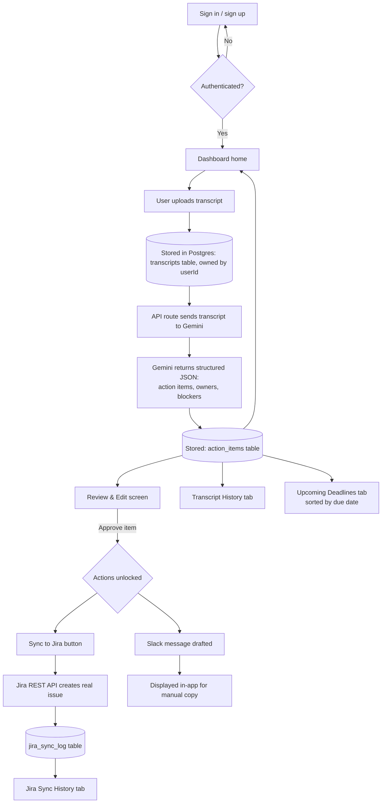

# SyncPM — Architecture

## 1. Tech Stack

| Layer | Choice | Why |
|---|---|---|
| Framework | Next.js (App Router) + TypeScript | Single framework for both UI and API routes — one deploy, no separate backend service to host |
| Styling | Tailwind CSS | Fast to build with; visual details finalized in `design.md` |
| Database | Postgres via Supabase (free tier) | Free, generous enough for single-user history data (transcripts, action items, sync logs); no separate file storage needed since transcripts are plain text |
| ORM | Prisma | Type-safe queries, simple migrations, easy to explain in an interview |
| LLM (extraction) | Google Gemini API (`gemini-2.5-flash` or `flash-lite`) | Free tier, ~1,500 requests/day, 1M tokens/minute — comfortably handles full transcripts; native structured JSON output reduces parsing failures |
| Jira integration | Jira Cloud REST API v3 | Real third-party API; authenticated via API token + Basic Auth |
| Auth | Auth.js (NextAuth v5), Credentials provider | Free, self-hosted — no Clerk/Auth0 account needed; JWT session strategy with a manual Prisma lookup in `authorize()`, so no extra Account/Session tables are required |
| Hosting | Vercel (Hobby/free tier) | Zero-cost hosting for a personal-use Next.js app; interviewers can click into a live URL |

## 2. App Flow



**Walkthrough:**
0. Visitor lands on the combined landing/login page. Once authenticated, they're redirected to `/dashboard` — a persistent sidebar (logo, Dashboard, Upload transcript, Transcript history, Jira tickets, Deadlines, signed-in user + sign out) wraps every page from here on. Middleware redirects unauthenticated requests for any of these routes back to `/`; it also redirects an already-authenticated visitor away from `/` straight to `/dashboard`.
1. From the sidebar, the user uploads a transcript (paste text or `.txt`/`.vtt`/`.srt` file) → stored in the `transcripts` table, tagged with their `userId`.
2. An API route sends the transcript to Gemini with a prompt requesting structured JSON output (action items, assigned owners, blockers).
3. The parsed result is stored in the `action_items` table, linked to the source transcript.
4. The Review & Edit screen shows everything for the user to correct before anything goes further.
5. Approving an item unlocks two things:
   - **Sync to Jira** — calls the Jira REST API to create a real issue; the result (success/failure, issue link) is logged in `jira_sync_log`.
   - **Slack draft** — a professional message is generated and shown for manual copy/paste (no live send in v1).
6. Four views read from this same data: Transcript History, Jira Sync History, Upcoming Deadlines (all open items sorted by due date), and **Dashboard** — the merged home/overview screen (replacing the earlier separate Weekly Status Dashboard) showing open item/blocker/synced counts, the most recent transcript, and a deadlines preview. If the user has no transcripts yet, Dashboard shows an empty state with a call-to-action to upload their first one instead.

## 3. Folder & File Structure

```
syncpm/
├── middleware.ts                      # Redirects unauthenticated requests to /, and authenticated visitors away from / to /dashboard
├── app/
│   ├── page.tsx                       # Combined landing + sign in/sign up page
│   ├── (app)/
│   │   ├── layout.tsx                 # Persistent sidebar shell wrapping every authenticated page
│   │   ├── dashboard/
│   │   │   └── page.tsx               # Dashboard home: stats, recent transcript, deadlines preview
│   │   ├── upload/
│   │   │   └── page.tsx               # Transcript upload screen
│   │   ├── review/[transcriptId]/
│   │   │   └── page.tsx               # Review & edit extracted items
│   │   ├── history/
│   │   │   ├── transcripts/page.tsx   # Transcript history
│   │   │   └── jira/page.tsx          # Jira sync history
│   │   └── deadlines/
│   │       └── page.tsx               # Full upcoming deadlines list
│   └── api/
│       ├── auth/[...nextauth]/route.ts # Auth.js sign in/sign up handlers
│       ├── transcripts/route.ts       # Handles upload + storage
│       ├── extract/route.ts           # Calls Gemini, parses response
│       ├── jira/sync/route.ts         # Calls Jira REST API
│       └── slack/draft/route.ts       # Generates Slack message draft
├── lib/
│   ├── db.ts                          # Prisma client instance
│   ├── auth.ts                        # Auth.js config (Credentials provider, JWT)
│   ├── gemini.ts                      # Gemini API wrapper
│   ├── jira.ts                        # Jira API client (Basic Auth)
│   └── prompts/
│       └── extraction.ts              # Prompt templates + JSON schema
├── components/
│   ├── Sidebar.tsx                    # Persistent nav: logo, links with active-route highlight, user email + sign out
│   ├── ActionItemCard.tsx
│   ├── TranscriptUploader.tsx
│   ├── JiraSyncButton.tsx
│   └── SlackDraftCard.tsx
├── prisma/
│   └── schema.prisma
├── prd.md
├── architecture.md
├── rules.md
├── phases.md
├── design.md
├── .env.example
└── package.json
```

## 4. Data Model (high-level)

- **users** — `id`, `email` (unique), `hashed_password`, `created_at`
- **transcripts** — `id`, `user_id` (FK, owner), `title`, `uploaded_at`, `raw_text`
- **action_items** — `id`, `transcript_id` (FK), `description`, `owner`, `due_date`, `status` (open/done), `is_blocker`, `blocker_note`, `is_approved` (unlocks Sync to Jira, per PRD 6.3)
- **jira_sync_log** — `id`, `action_item_id` (FK), `jira_issue_key`, `jira_url`, `status` (synced/failed), `synced_at`

Ownership is scoped at the `transcripts` level only — `action_items` and `jira_sync_log` inherit ownership through their parent transcript, so every query for a user's data filters `transcripts` by `user_id` first, then joins down.

## 5. Key Technical Considerations

- **Vercel Hobby function timeout** is 10 seconds by default — keep the Gemini extraction call as a single request per transcript (not per action item), and configure `maxDuration` on that route if longer transcripts need it.
- **Gemini free tier** is generous for single-user use, but code defensively for `429` responses with exponential backoff.
- **Jira credentials** (account email + API token) live only in Vercel environment variables — never in client-side code or committed to the repo.
- **No secrets in git** — ship a `.env.example` with placeholder keys; the real `.env` is gitignored.
- **Passwords** are hashed with bcrypt before storage — never stored or logged in plain text.
- **`AUTH_SECRET`** (required by Auth.js) lives in environment variables like every other secret — generate once, set in `.env` and all three Vercel environments.
- **Every data-fetching query** must filter by the signed-in user's `user_id` — there is no "admin" or cross-user view in v1, so a missed filter is a real data leak between accounts, not just a display bug.
- **Dashboard and Deadlines queries** sort across all of a user's `action_items` by `due_date` — fine at this data scale without one, but add a Prisma index on `(transcript_id, due_date)` if it's ever noticeably slow.
