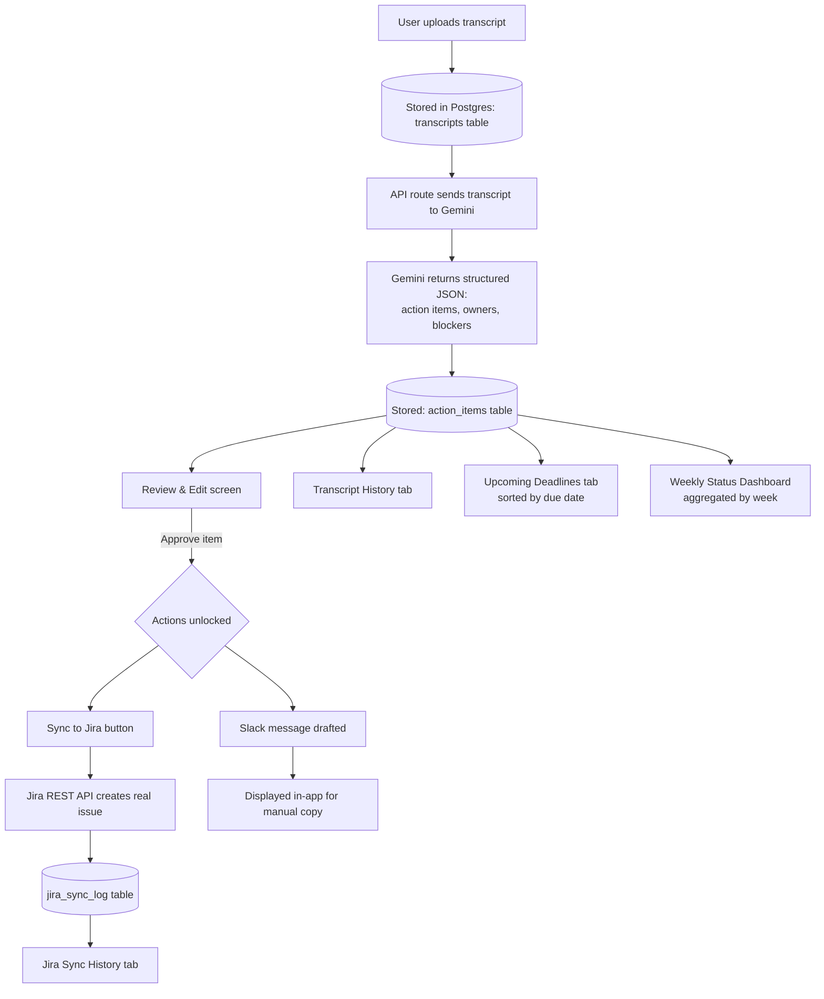

# SyncPM — Architecture

## 1. Tech Stack

| Layer | Choice | Why |
|---|---|---|
| Framework | Next.js (App Router) + TypeScript | Single framework for both UI and API routes — one deploy, no separate backend service to host |
| Styling | Tailwind CSS | Fast to build with; visual details finalized in `design.md` |
| Database | Postgres via Supabase (free tier) | Free, generous enough for single-user history data (transcripts, action items, sync logs); no separate file storage needed since transcripts are plain text |
| ORM | Prisma | Type-safe queries, simple migrations, easy to explain in an interview |
| LLM (extraction) | Google Gemini API (`gemini-2.5-flash` or `flash-lite`) | Free tier, ~1,500 requests/day, 1M tokens/minute — comfortably handles full transcripts; native structured JSON output reduces parsing failures |
| Jira integration | Jira Cloud REST API v3 | Real third-party API; authenticated via API token + Basic Auth |
| Hosting | Vercel (Hobby/free tier) | Zero-cost hosting for a personal-use Next.js app; interviewers can click into a live URL |

## 2. App Flow



**Walkthrough:**
1. User uploads a transcript (paste text or `.txt`/`.vtt`/`.srt` file) → stored as-is in the `transcripts` table.
2. An API route sends the transcript to Gemini with a prompt requesting structured JSON output (action items, assigned owners, blockers).
3. The parsed result is stored in the `action_items` table, linked to the source transcript.
4. The Review & Edit screen shows everything for the user to correct before anything goes further.
5. Approving an item unlocks two things:
   - **Sync to Jira** — calls the Jira REST API to create a real issue; the result (success/failure, issue link) is logged in `jira_sync_log`.
   - **Slack draft** — a professional message is generated and shown for manual copy/paste (no live send in v1).
6. Four views read from this same data: Transcript History, Jira Sync History, Upcoming Deadlines (all open items sorted by due date), and the Weekly Status Dashboard (aggregated by week).

## 3. Folder & File Structure

```
syncpm/
├── app/
│   ├── page.tsx                       # Landing/home
│   ├── upload/
│   │   └── page.tsx                   # Transcript upload screen
│   ├── review/[transcriptId]/
│   │   └── page.tsx                   # Review & edit extracted items
│   ├── history/
│   │   ├── transcripts/page.tsx       # Transcript history
│   │   └── jira/page.tsx              # Jira sync history
│   ├── deadlines/
│   │   └── page.tsx                   # Upcoming deadlines tab
│   ├── dashboard/
│   │   └── page.tsx                   # Weekly status dashboard
│   └── api/
│       ├── transcripts/route.ts       # Handles upload + storage
│       ├── extract/route.ts           # Calls Gemini, parses response
│       ├── jira/sync/route.ts         # Calls Jira REST API
│       └── slack/draft/route.ts       # Generates Slack message draft
├── lib/
│   ├── db.ts                          # Prisma client instance
│   ├── gemini.ts                      # Gemini API wrapper
│   ├── jira.ts                        # Jira API client (Basic Auth)
│   └── prompts/
│       └── extraction.ts              # Prompt templates + JSON schema
├── components/
│   ├── ActionItemCard.tsx
│   ├── TranscriptUploader.tsx
│   ├── JiraSyncButton.tsx
│   └── SlackDraftCard.tsx
├── prisma/
│   └── schema.prisma
├── prd.md
├── architecture.md
├── rules.md
├── phases.md
├── design.md
├── .env.example
└── package.json
```

## 4. Data Model (high-level)

- **transcripts** — `id`, `title`, `uploaded_at`, `raw_text`
- **action_items** — `id`, `transcript_id` (FK), `description`, `owner`, `due_date`, `status` (open/done), `is_blocker`, `blocker_note`
- **jira_sync_log** — `id`, `action_item_id` (FK), `jira_issue_key`, `jira_url`, `status` (synced/failed), `synced_at`

## 5. Key Technical Considerations

- **Vercel Hobby function timeout** is 10 seconds by default — keep the Gemini extraction call as a single request per transcript (not per action item), and configure `maxDuration` on that route if longer transcripts need it.
- **Gemini free tier** is generous for single-user use, but code defensively for `429` responses with exponential backoff.
- **Jira credentials** (account email + API token) live only in Vercel environment variables — never in client-side code or committed to the repo.
- **No secrets in git** — ship a `.env.example` with placeholder keys; the real `.env` is gitignored.
