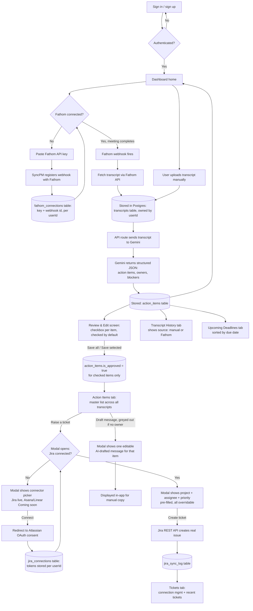

# SyncPM — Architecture

## 1. Tech Stack

| Layer | Choice | Why |
|---|---|---|
| Framework | Next.js (App Router) + TypeScript | Single framework for both UI and API routes — one deploy, no separate backend service to host |
| Styling | Tailwind CSS | Fast to build with; visual details finalized in `design.md` |
| Database | Postgres via Supabase (free tier) | Free, generous enough for single-user history data (transcripts, action items, sync logs); no separate file storage needed since transcripts are plain text |
| ORM | Prisma | Type-safe queries, simple migrations, easy to explain in an interview |
| LLM (extraction) | Google Gemini API — primary `gemini-2.5-flash`, fallback `gemini-flash-lite-latest` | Free tier; daily quota (`GenerateRequestsPerDayPerProjectPerModel-FreeTier`) is tracked separately per model, so the fallback has its own untouched quota when the primary's is exhausted. Note: `gemini-2.5-flash-lite` (the originally planned pinned Lite model) 404s as deprecated for new projects — confirmed directly against the live API — so the fallback uses Google's rolling "latest" alias instead, trading a pinned/reproducible model for one that won't hit this same deprecation issue again. Native structured JSON output on both reduces parsing failures. |
| Jira integration | Jira Cloud REST API v3, via OAuth 2.0 (3LO) | Each user connects their own Jira site — no shared credentials. Access tokens call through `api.atlassian.com/ex/jira/{cloudId}/...`, refreshed automatically when expired |
| Fathom integration | Fathom API, via personal API key + webhook | Each user pastes their own API key (already scoped per-user by Fathom, so no OAuth needed for a non-marketplace integration); a registered webhook auto-imports every new meeting |
| Auth | Auth.js (NextAuth v5), Credentials provider | Free, self-hosted — no Clerk/Auth0 account needed; JWT session strategy with a manual Prisma lookup in `authorize()`, so no extra Account/Session tables are required |
| Hosting | Vercel (Hobby/free tier) | Zero-cost hosting for a personal-use Next.js app; interviewers can click into a live URL |
| Icons (brands) | `simple-icons` (or equivalent permissively-licensed set) | Real, recognizable brand marks for Jira/Asana/Linear/Zoom/Google Meet/Fathom in connector UIs — not hand-drawn approximations |
| Icons (UI) | `lucide-react` | Generic interface icons (nav items, buttons) — separate concern from brand logos above, since simple-icons only covers actual company marks |

## 2. App Flow



**Walkthrough:**
0. Visitor lands on the combined landing/login page. Once authenticated, they're redirected to `/dashboard` — a persistent sidebar (logo, Dashboard, Upload transcript, Transcript history, Action items, Tickets, Deadlines, How to use, signed-in user + sign out) wraps every page from here on. Middleware redirects unauthenticated requests for any of these routes back to `/`; it also redirects an already-authenticated visitor away from `/` straight to `/dashboard`.
1. From the sidebar, the user uploads a transcript (paste text or `.txt`/`.vtt`/`.srt` file) → stored in the `transcripts` table, tagged with their `userId`. Alternatively, if they've connected Fathom, this step happens automatically: pasting a personal Fathom API key (found in their own Fathom account settings) triggers SyncPM to register a webhook with Fathom for that account; every subsequent completed meeting fires that webhook, SyncPM fetches the transcript via the Fathom API, and stores it exactly like a manual upload — same table, same `userId` tagging, same downstream pipeline from here on.
2. An API route sends the transcript to Gemini with a prompt requesting structured JSON output (action items, assigned owners, blockers).
3. The parsed result is stored in the `action_items` table, linked to the source transcript.
4. The Review & Edit screen shows every extracted item with a checkbox, **checked by default**. The user edits fields inline (owner, due date, status, a free-text "blockers" note), permanently deletes anything wrongly extracted, and unchecks anything they aren't ready to approve yet (unchecking just defers — it doesn't delete). One button — "Save all" or "Save selected," depending on whether anything's unchecked — marks the checked items `is_approved` and persists any edits.
5. Approved items appear in the **Action Items tab** — the master list across every transcript, not just the one just reviewed. Each row has its own **Status** dropdown, **Raise a ticket**, and **Draft message** actions, in that order. "Raise a ticket" opens a modal, not a page navigation: if the user has no Jira connection yet, it shows the connector picker (Jira live; Asana and Linear as "Coming soon" placeholders); connecting redirects to Atlassian's OAuth consent screen and, on approval, returns the user to this same row with the modal reopened. Once connected, the modal instead shows project/assignee/priority dropdowns (priority pre-selected from whether the item has a non-empty blockers note, always overridable). "Create ticket" calls the Jira REST API with the user's own token to create a real issue; the result is logged in `jira_sync_log`.
6. **"Draft message"** is a per-row action too (not a per-transcript batch action) — greyed out until the row has an owner set. Clicking it opens a modal with one AI-drafted, editable message about that single action item (description, owner, due date, blocker note if any) — shown for manual copy/paste, no live send in v1. Nothing is persisted between sessions.
7. Several views read from this same data: Transcript History, **Action Items tab** (per above), **Tickets tab** (Jira connection management, default project, recently created tickets — distinct from the per-item modal), Upcoming Deadlines (all open items sorted by due date), and **Dashboard** — the merged home/overview screen showing four stat cards (open items, blockers, completed, tickets raised — the last renamed from "synced to Jira" since Jira is one of several connectable tools), a **Recent transcripts** list (last 5) alongside an **Upcoming deadlines** preview (top 10). If the user has no transcripts yet, Dashboard shows an empty state with a call-to-action to upload their first one instead. No page in the app has a descriptive subheader under its title — every title stands alone.

## 3. Folder & File Structure

```
syncpm/
├── middleware.ts                      # Redirects unauthenticated requests to /, and authenticated visitors away from / to /dashboard
├── app/
│   ├── page.tsx                       # Combined landing + sign in/sign up page
│   ├── (app)/
│   │   ├── layout.tsx                 # Persistent sidebar shell wrapping every authenticated page
│   │   ├── dashboard/
│   │   │   └── page.tsx               # Dashboard home: stats, recent transcript, deadlines preview
│   │   ├── upload/
│   │   │   └── page.tsx               # Transcript upload screen
│   │   ├── review/[transcriptId]/
│   │   │   └── page.tsx               # Review & edit: checkbox per item, inline field edits, Save all/selected — no ticket-raising here anymore
│   │   ├── action-items/
│   │   │   └── page.tsx               # Master list of approved items across all transcripts — Raise a ticket, edit, delete
│   │   ├── history/
│   │   │   └── transcripts/page.tsx   # Transcript history
│   │   ├── tickets/
│   │   │   └── page.tsx               # Connector picker (Jira live; Asana/Linear "Coming soon") + connected state + recent tickets
│   │   └── deadlines/
│   │       └── page.tsx               # Full upcoming deadlines list
│   └── api/
│       ├── auth/[...nextauth]/route.ts # Auth.js sign in/sign up handlers
│       ├── integrations/jira/
│       │   ├── connect/route.ts       # Redirects to Atlassian OAuth consent
│       │   ├── callback/route.ts      # Exchanges code for tokens, stores in jira_connections
│       │   └── disconnect/route.ts    # Revokes/deletes the stored connection
│       ├── integrations/fathom/
│       │   ├── connect/route.ts       # Accepts a pasted API key, validates it, registers a webhook, stores fathom_connections
│       │   ├── webhook/[connectionId]/route.ts  # Receives Fathom's "meeting ready" event, fetches transcript, feeds it into extraction
│       │   ├── backfill/route.ts      # Manual sync: lists meetings from the last 30 days, imports any missing fathom_meeting_id (webhook-missed recovery)
│       │   └── disconnect/route.ts    # Deletes the webhook on Fathom's side, then the local row
│       ├── transcripts/route.ts       # Handles upload + storage
│       ├── extract/route.ts           # Calls Gemini, parses response
│       ├── jira/sync/route.ts         # Calls Jira REST API using the signed-in user's stored token
│       └── slack/draft/route.ts       # Takes a single actionItemId, drafts one message for that item's owner (not grouped across a transcript)
├── lib/
│   ├── db.ts                          # Prisma client instance
│   ├── auth.ts                        # Auth.js config (Credentials provider, JWT)
│   ├── gemini.ts                      # Gemini API wrapper
│   ├── jira.ts                        # Jira API client — resolves the user's stored OAuth token, refreshes if expired, calls api.atlassian.com
│   ├── fathom.ts                      # Fathom API client — validates keys, registers/deletes webhooks, fetches meeting transcripts
│   └── prompts/
│       └── extraction.ts              # Prompt templates + JSON schema
├── components/
│   ├── Sidebar.tsx                    # Persistent nav: logo, links with active-route highlight, user email + sign out
│   ├── ActionItemFields.tsx           # SHARED: owner, due date, status, blockers — the one editable-fields implementation used by ActionItemCard, ActionItemRow, and the Deadlines page card, so field behavior/styling can't drift between them
│   ├── ActionItemCard.tsx             # Review & Edit only: wraps ActionItemFields + checkbox, delete — no Raise a ticket button anymore
│   ├── ActionItemRow.tsx              # Action Items tab only: wraps ActionItemFields + source transcript, Raise a ticket / edit / delete
│   ├── TranscriptUploader.tsx
│   ├── ExtractionLoader.tsx           # Staged-message loading state shown while Gemini extraction is in flight (cycles: reading → identifying owners → extracting → checking blockers)
│   ├── JiraSyncButton.tsx             # Lives in ActionItemRow (Action Items tab), not ActionItemCard — opens RaiseATicketModal on click
│   ├── RaiseATicketModal.tsx          # Per-item modal: connector picker (not connected) or project+assignee+priority fields (connected, cascading — project change reloads assignee list)
│   ├── ConnectorPicker.tsx            # Jira/Asana/Linear cards, Connect buttons, "Coming soon" states — shared by the modal and the standalone tab
│   ├── SourceConnectorRow.tsx         # Fathom (real "Connect"/"Connected" state), Zoom/Google Meet ("Coming soon" placeholders) above the manual upload area
│   ├── FathomConnectModal.tsx         # Paste-API-key form, with a link to where Fathom shows it; shows connected status + Disconnect once linked
│   ├── DashboardEmptyState.tsx        # First-time-user welcome: Connect Fathom (recommended, primary) + Upload a transcript (secondary), plus a 3-step workflow preview
│   ├── SlackDraftModal.tsx            # Lives in ActionItemRow (Action Items tab), per-item like JiraSyncButton — greyed out with no owner; one editable AI-drafted message + Copy
│   └── HowToUseModal.tsx              # Static reference walkthrough, opened from the sidebar's "How to use" item (info-circle icon, no route/active state)
├── prisma/
│   └── schema.prisma
├── evals/
│   ├── cases/                          # Sample transcripts paired with hand-authored expected outputs (JSON)
│   └── run.ts                          # Calls the same shared lib/extraction.ts used in production; runs each case multiple trials, reports a pass rate
├── prd.md
├── architecture.md
├── rules.md
├── phases.md
├── design.md
├── .env.example
└── package.json
```

## 4. Data Model (high-level)

- **users** — `id`, `email` (unique), `hashed_password`, `created_at`
- **jira_connections** — `id`, `user_id` (FK, unique — one connection per user in v1), `access_token`, `refresh_token`, `expires_at`, `cloud_id`, `site_url`, `site_name`, `project_key` (chosen default project), `created_at`
- **fathom_connections** — `id`, `user_id` (FK, unique — one connection per user in v1), `api_key`, `webhook_secret` (for verifying incoming webhook signatures), `fathom_webhook_id` (needed to delete the webhook on disconnect), `created_at`
- **transcripts** — `id`, `user_id` (FK, owner), `title`, `uploaded_at`, `raw_text`, `source` (`manual` | `fathom`), `fathom_meeting_id` (nullable, unique when present — prevents double-importing the same meeting if a webhook fires more than once), `extraction_status` (`succeeded` | `failed`, defaulting to `succeeded`) — records whether the Gemini extraction for this transcript completed or errored. Necessary because a failed extraction and a transcript that genuinely contained no action items both leave a row with zero `action_items`, making them indistinguishable after the fact; this was a real incident on the Fathom backfill path, where a swallowed failure returned HTTP 200 and looked like a successful import. Transcript History reads this to show "Extraction failed" rather than "0 action items" (see `rules.md` §2, async import paths).
- **action_items** — `id`, `transcript_id` (FK), `description`, `owner`, `owner_evidence` (nullable — the exact transcript quote the model used to justify the owner assignment; see 5's Owner Evidence note below), `due_date`, `status` (open/done), `is_approved` (set by "Save all"/"Save selected" on Review & Edit — this is what makes an item appear in the Action Items tab), `blocker_note` (nullable — a non-empty value *is* what makes an item a blocker; there is no separate boolean, removing a field that would otherwise need to be kept manually in sync with this one)
- **jira_sync_log** — `id`, `action_item_id` (FK), `jira_issue_key`, `jira_url`, `jira_project_key`, `assignee_account_id` (nullable), `priority`, `status` (synced/failed), `synced_at`

Ownership is scoped at the `transcripts` level only — `action_items` and `jira_sync_log` inherit ownership through their parent transcript, so every query for a user's data filters `transcripts` by `user_id` first, then joins down. `jira_connections` and `fathom_connections` are each scoped directly by `user_id`.

## 5. Key Technical Considerations

- **Vercel Hobby function timeout** is 10 seconds by default — keep the Gemini extraction call as a single request per transcript (not per action item), and configure `maxDuration` on that route if longer transcripts need it.
- **Gemini free tier** is generous for single-user use, but code defensively for `429` responses with exponential backoff.
- **Jira credentials** — the OAuth app's own `JIRA_OAUTH_CLIENT_ID` and `JIRA_OAUTH_CLIENT_SECRET` live in Vercel environment variables (these identify SyncPM itself to Atlassian, shared across all users); each individual user's access/refresh tokens live in `jira_connections`, never in environment variables or client-side code.
- **No secrets in git** — ship a `.env.example` with placeholder keys; the real `.env` is gitignored.
- **Passwords** are hashed with bcrypt before storage — never stored or logged in plain text.
- **`AUTH_SECRET`** (required by Auth.js) lives in environment variables like every other secret — generate once, set in `.env` and all three Vercel environments.
- **Every data-fetching query** must filter by the signed-in user's `user_id` — there is no "admin" or cross-user view in v1, so a missed filter is a real data leak between accounts, not just a display bug.
- **Dashboard and Deadlines queries** sort across all of a user's `action_items` by `due_date` — fine at this data scale without one, but add a Prisma index on `(transcript_id, due_date)` if it's ever noticeably slow.
- **Jira OAuth tokens expire** (roughly hourly) and the refresh token rotates on each use — `lib/jira.ts` must check `expires_at` before every call, refresh if needed, and overwrite both `access_token` and `refresh_token` in `jira_connections` with the new pair Atlassian returns. Using a stale refresh token after it's rotated will fail.
- **OAuth return context** — when a user connects Jira from inside the per-item modal (rather than the standalone tab), the `state` parameter passed to Atlassian's authorize URL should encode both the CSRF token and the `actionItemId` the user started from, so the callback route can redirect back to that specific action item with the modal reopened, instead of landing on the generic Tickets tab.
- **Assignee resolution** — fetch the connected project's assignable users via Jira's REST API, then do a simple best-effort name match against the extracted owner string (e.g. case-insensitive substring match on first/last name) to pre-select a likely match in the modal's dropdown. This is a convenience default only — the user always confirms or changes it before creating the ticket, so the match doesn't need to be perfect. Note that per the Owner Evidence rule below, an owner the model couldn't justify with a quote is null, so there is no name to match against in that case and the dropdown starts unselected.
- **Owner Evidence (`owner_evidence`)** — `ExtractedActionItem` (`lib/prompts/extraction.ts`) carries `ownerEvidence: string | null` alongside `owner`. The Gemini `responseSchema` has a matching nullable-string property, with a field description instructing the model to output the exact transcript quote it used to determine the owner — the phrase that names or directly addresses the person, not a paraphrase. `validateExtractionResult` enforces the coupling: if `owner` is non-null but `ownerEvidence` is null/empty, `owner` is set to null; evidence without an owner is dropped. This guarantee holds **as extraction writes rows** — owner-without-evidence is a legitimate post-edit state, since the PATCH route clears `owner_evidence` whenever a human changes `owner` and never repopulates it. **This field is not surfaced in the UI anywhere** — the caption and collapsed-icon treatments were both built and rejected as clutter (see PRD 6.2a). Its value is the validation guard, not display: an owner the model can't justify never reaches the Jira assignee pre-fill. The eval harness (`evals/`) checks `ownerEvidence` is present and non-empty whenever `owner` is expected to be non-null, and is unaffected by the absence of UI.
- **`is_blocker` → `blocker_note`-derived migration** — several already-built features queried the old `is_blocker` boolean directly: Dashboard's blocker count, Transcript History's blocker count, Deadlines' blocker tag, and the Raise a ticket modal's priority pre-selection. All of these need updating to check `blocker_note IS NOT NULL AND blocker_note != ''` instead — don't miss any of these call sites when removing the column.
- **Fathom API key** lives in `fathom_connections`, scoped per-user, never in environment variables or client-side code — same treatment as Jira's tokens.
- **Fathom webhook endpoint is multi-tenant** — since the same route handles every user's events, the webhook URL registered with Fathom includes the `fathom_connections` row's own id in the path (`/api/integrations/fathom/webhook/[connectionId]`) so incoming events can be matched to the right user without ambiguity, rather than trying to identify the user from the payload alone.
- **Verify the Fathom webhook's authenticity before processing.** Confirmed mechanism: every webhook request includes three headers — `webhook-id`, `webhook-timestamp`, and `webhook-signature` (a space-delimited list of Base64-encoded signatures, each prefixed with a version identifier like `v1,`). The signed content is `${webhook-id}.${webhook-timestamp}.${rawBody}` (not just the raw body alone) — compute an HMAC-SHA256 over that concatenated string using the **webhook signing secret** (strip its `whsec_` prefix, then base64-decode it before use), then compare against each signature in the header using a constant-time comparison (never a plain `===`, which leaks timing information). Reject the request if none match. `fathom_connections` stores this signing secret alongside the API key.
- **Fathom base URL and auth header:** `https://api.fathom.ai/external/v1`, authenticated via an `X-Api-Key` header (not Bearer) — confirm this against the live docs at implementation time in case it's changed, but this is the currently documented pattern.
- **Idempotency** — a webhook can fire more than once for the same meeting. Before creating a new transcript, check whether `fathom_meeting_id` already exists for that user; if it does, skip re-importing rather than creating a duplicate.
- **Disconnecting Fathom** should delete the registered webhook on Fathom's side (via its webhook-deletion endpoint), not just the local `fathom_connections` row — otherwise Fathom keeps trying to deliver events to a connection that no longer exists locally.
- **Fathom rate limit** is 60 requests/minute across all of an account's API keys — comfortably enough for this use case (one fetch per completed meeting), but worth knowing if testing involves rapid repeated calls.
